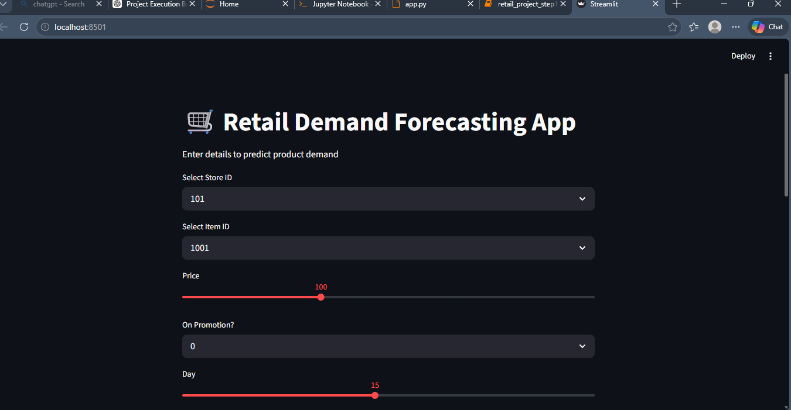
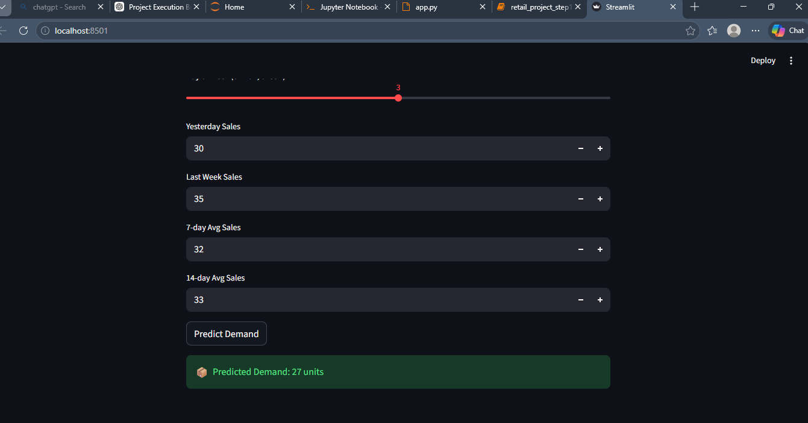
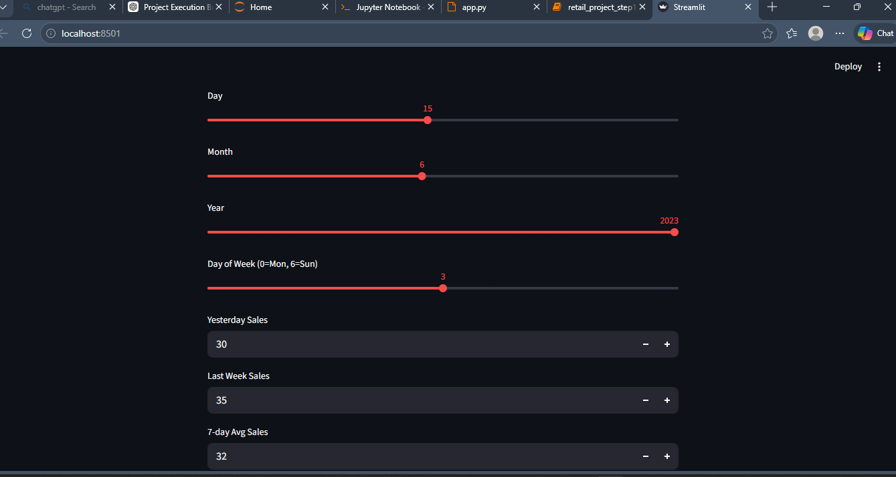

# 🛒 Retail Demand Forecasting

## 📌 Project Overview

Retail Demand Forecasting is a data science project designed to predict future product demand based on historical sales data. Accurate demand forecasting helps businesses optimize inventory, reduce stockouts, and improve overall supply chain efficiency.

---

## 🎯 Objectives

* Analyze historical retail data to identify trends and patterns
* Build a machine learning model to forecast product demand
* Deploy a simple application for real-time predictions
* Assist businesses in data-driven decision-making

---

## 🗂️ Project Structure

```
retail-demand-forecasting/
│
├── app/
│   └── app.py                # Streamlit/Flask app
│
├── data/
│   ├── raw/                 # Original dataset
│   └── processed/           # Cleaned dataset
│
├── models/
│   └── model.pkl            # Trained model
│
├── notebooks/
│   └── analysis.ipynb       # EDA & model development
│
├── requirements.txt         # Dependencies
├── README.md                # Project documentation
└── .gitignore
```

---

## ⚙️ Tech Stack

* Python 🐍
* Pandas, NumPy
* Scikit-learn
* Matplotlib / Seaborn
* Streamlit (for deployment)

---

## 📊 Features

* Data preprocessing and cleaning
* Exploratory Data Analysis (EDA)
* Machine learning model for demand prediction
* Interactive web app for user input
* Visualization of trends and predictions

---

## 🚀 How to Run the Project

### 1️⃣ Clone the repository

```
git clone https://github.com/your-username/retail-demand-forecasting.git
cd retail-demand-forecasting
```

### 2️⃣ Create virtual environment

```
python -m venv venv
venv\Scripts\activate
```

### 3️⃣ Install dependencies

```
pip install -r requirements.txt
```

### 4️⃣ Run the application

```
streamlit run app/app.py
```

---

## 📈 Results & Insights

* Identified demand patterns across stores and items
* Improved forecasting accuracy using machine learning
* Enabled better inventory planning

---

## 📷 Screenshots





## 🔮 Future Enhancements

* Use advanced models (XGBoost, LSTM)
* Add real-time data integration
* Deploy on cloud (AWS / Streamlit Cloud)
* Improve UI/UX

---

## 🤝 Contribution

Contributions are welcome!
Feel free to fork the repository and submit a pull request.

---

## 📜 License

This project is licensed under the MIT License.

---

## 👨‍💻 Author

Tejaswini Ahire


---

## ⭐ If you like this project

Give it a star on GitHub ⭐

